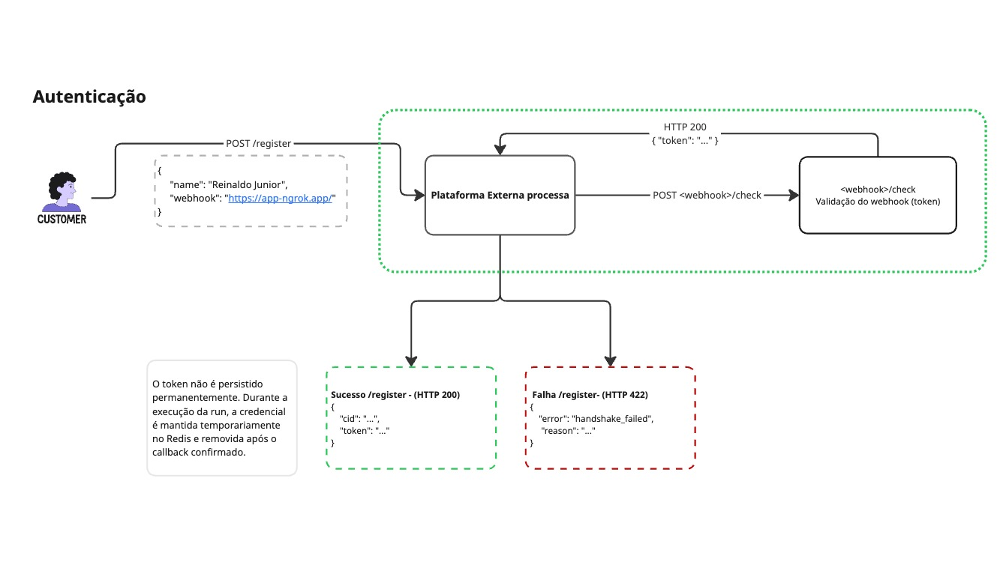

# Autenticação e registro do webhook

O fluxo normal começa pela API do próprio backend, disponível em `http://localhost:3000/docs`.

Execute `POST /platform/register` com nome e webhook publicamente acessível (por exemplo, a URL atual do ngrok):

A aplicação envia:

```http
POST /platform/register
Content-Type: application/json

{
  "name": "Nome para o registro",
  "webhook": "https://seu-ngrok.ngrok-free.app"
}
```

O backend encaminha o registro para `PLATAFORMA_REGISTER_URL`. A plataforma realiza o handshake chamando:

```http
POST <webhook>/check
```

O endpoint `/check` devolve o token recebido sem alteração. Em caso de sucesso, `/platform/register` retorna `cid` e `token` para o operador copiar e usar no `POST /runs/burst`.

O token não é persistido nem logado. Depois do burst, fica somente em memória associado ao `runId` para o processamento de enrich.

Resposta:

```json
{
  "cid": "...",
  "token": "..."
}
```

Para o fluxo manual completo, consulte [Teste real manual pelo Swagger](./teste-real-manual.md).

