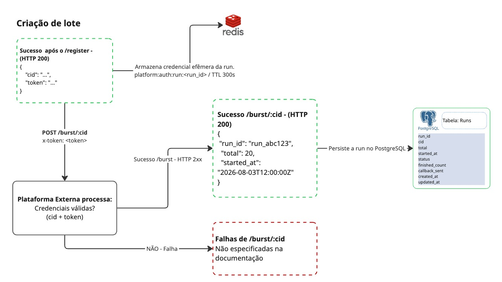

# Criação do lote

Após o registro e validação do webhook, o serviço recebe um `cid` e um `token`.

Essas informações são utilizadas para solicitar a criação de uma nova execução na plataforma externa.

## Solicitação do lote

No fluxo normal, o operador copia o `cid` e o `token` retornados pelo `POST /platform/register` e envia ao backend:

```http
POST /runs/burst
Content-Type: application/json

{
  "cid": "<cid>",
  "token": "<token>"
}
```

O backend realiza a chamada externa:

```http
POST /burst/:cid
x-token: <token>
```

Onde:

- `cid` identifica o cadastro realizado anteriormente;
- `x-token` autentica a requisição.

A plataforma externa valida se o `cid` e o `token` correspondem a uma credencial válida.

## Criação da execução

Em caso de sucesso, a plataforma externa cria um novo lote e retorna os metadados da execução:

```json
{
  "run_id": "run_abc123",
  "cid": "cid_exemplo",
  "total": 20,
  "started_at": "2026-08-03T12:00:00Z"
}
```

Os campos representam:

- `run_id`: identificador único da execução;
- `total`: quantidade total de itens que serão enviados para processamento;
- `started_at`: data e hora de início da execução.

Cada nova chamada ao `/burst/:cid` gera uma nova execução e, consequentemente, um novo `run_id`.

## Persistência do lote

Após validar a resposta externa do `/burst/:cid`, o backend persiste os dados da execução antes de responder `201` ao cliente. Portanto, uma resposta de sucesso de `POST /runs/burst` significa que a run já foi criada internamente.

O token é usado apenas para a chamada externa e fica associado ao `runId` em memória por até 24 horas para autenticar o enrich. Ele não é persistido nem registrado em logs. O cache é perdido ao reiniciar o backend.

O objetivo dessa persistência é manter o controle do ciclo de vida do lote durante todo o processamento.

A tabela proposta para esse controle é:

```text
runs
```

Com os seguintes campos:

```text
run_id
cid
total
started_at
status
finished_count
callback_sent
created_at
updated_at
```

### Responsabilidade dos campos

- `run_id`: identificador único do lote;
- `cid`: identificador do cadastro na plataforma externa;
- `total`: quantidade total de itens esperados;
- `started_at`: momento em que a plataforma iniciou a execução;
- `status`: estado atual do lote;
- `finished_count`: quantidade de itens já finalizados;
- `callback_sent`: informa se o resultado final já foi enviado;
- `created_at`: data de criação do registro interno;
- `updated_at`: data da última atualização do lote.

O `run_id` deve ser único:

```text
UNIQUE (run_id)
```

Ao criar o lote internamente, o estado inicial será equivalente a:

```text
status = PROCESSING
finished_count = 0
callback_sent = false
```

## Relação com os itens processados

A tabela `runs` representa o lote como um todo.

Os itens individuais recebidos posteriormente pelo endpoint `/process` serão persistidos em outra tabela:

```text
run_items
```

O relacionamento entre as duas estruturas será feito através do `run_id`:

```text
runs.run_id
    1
    |
    |---- N
            run_items.run_id
```

Assim, um lote pode possuir vários itens processados.

Essa separação permite:

- acompanhar o progresso da execução;
- manter rastreabilidade por item;
- controlar mensagens duplicadas;
- identificar falhas individuais;
- saber quando todos os itens do lote foram finalizados;
- controlar o envio do callback final.

## Início do processamento

Após a criação do lote, a plataforma externa começa a enviar os itens da execução para:

```http
POST /process
```

Cada mensagem possui um payload semelhante a:

```json
{
  "run_id": "run_abc123",
  "seq": 0,
  "sku": "sku-001"
}
```

O `run_id` recebido no `/process` permite associar cada item ao lote previamente persistido na tabela `runs`.

A partir desse momento, o processamento passa a ser responsabilidade do fluxo assíncrono da aplicação.

## Atualização do lote

À medida que os itens são processados, o registro correspondente em `runs` será atualizado.

Por exemplo:

```text
finished_count = 12
status = PROCESSING
```

Quando todos os itens únicos tiverem sido finalizados:

```text
finished_count == total
```

o lote estará pronto para consolidação e envio do resultado final.

Após o envio bem-sucedido do `/callback`, o lote poderá ser atualizado para:

```text
status = COMPLETED
callback_sent = true
```

## Tratamento de falhas

A documentação fornecida não especifica um contrato de erro próprio para o endpoint `/burst/:cid`.

Por esse motivo, a arquitetura considera apenas o fluxo de sucesso documentado e evita assumir códigos ou formatos de erro não definidos pelo contrato.

## Diagrama



## Próxima etapa

O fluxo continua no processamento assíncrono dos itens:

[Processamento assíncrono](./processamento.md)
