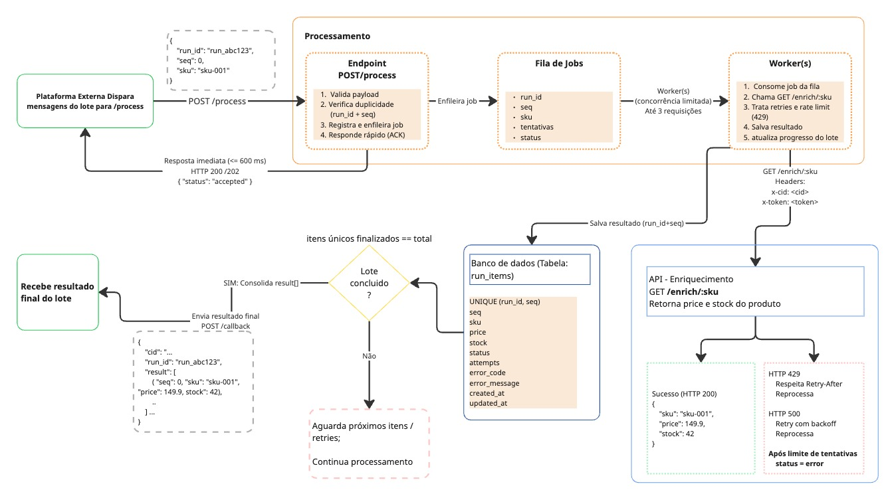

# Processamento assíncrono

Após a criação do lote, a plataforma externa começa a disparar as mensagens de processamento para o endpoint:

```http
POST /process
```

Cada mensagem representa um item do lote e possui um payload semelhante a:

```json
{
  "run_id": "run_abc123",
  "seq": 0,
  "sku": "sku-001"
}
```

O `run_id` identifica o lote ao qual o item pertence, enquanto a combinação `run_id + seq` identifica de forma única cada mensagem dentro da execução.

## Objetivo do `/process`

O endpoint `/process` foi desenhado para executar apenas operações rápidas:

1. validar o payload;
2. verificar duplicidade através de `run_id + seq`;
3. registrar e enfileirar o job;
4. responder o ACK rapidamente.

O processamento pesado não deve acontecer dentro da requisição HTTP.

A resposta deverá ocorrer dentro do SLA de até `600 ms`.

Exemplo:

```http
HTTP 200
```

ou:

```http
HTTP 202
```

Com um payload semelhante a:

```json
{
  "status": "accepted"
}
```

## Idempotência

A entrega das mensagens é `at-least-once`, portanto mensagens duplicadas podem ocorrer.

Para evitar processamento duplicado, a combinação:

```text
run_id + seq
```

será utilizada como chave de idempotência.

A persistência dos itens utilizará uma restrição equivalente a:

```text
UNIQUE (run_id, seq)
```

Dessa forma, uma mensagem duplicada pode ser identificada antes de iniciar uma nova chamada ao serviço de enriquecimento.

## Fila de jobs

Após a validação, o item é encaminhado para uma fila de processamento assíncrono.

Cada job pode carregar informações como:

```text
run_id
seq
sku
tentativas
status
```

A fila desacopla o recebimento do processamento e permite que o endpoint `/process` responda rapidamente sem aguardar a chamada ao serviço externo de enriquecimento.

## Workers

Os workers são responsáveis por consumir os jobs da fila.

Suas principais responsabilidades são:

1. consumir o job;
2. chamar o serviço externo de enriquecimento;
3. tratar retries e rate limit;
4. persistir o resultado;
5. atualizar o progresso do lote.

## Controle de concorrência

O serviço externo de enriquecimento permite no máximo três requisições simultâneas.

Por isso, o processamento deverá utilizar um limitador global de concorrência:

```text
máximo de 3 chamadas para /enrich/:sku
```

Esse limite deve ser respeitado independentemente da quantidade de workers existentes.

Aumentar a quantidade de workers pode melhorar outras etapas do pipeline, mas não deve aumentar a quantidade total de chamadas simultâneas ao `/enrich/:sku`.

## Enriquecimento

Cada worker consulta:

```http
GET /enrich/:sku
```

Com os headers:

```http
x-cid: <cid>
x-token: <token>
```

Resposta de sucesso:

```json
{
  "sku": "sku-001",
  "price": 149.9,
  "stock": 42
}
```

## Tratamento de falhas

O serviço de enriquecimento pode retornar falhas transitórias.

### HTTP 429

Quando o limite de concorrência for excedido:

```text
HTTP 429
→ respeitar Retry-After
→ reprocessar o job
```

### HTTP 500

Para falhas transitórias:

```text
HTTP 500
→ retry com backoff
→ reprocessar o job
```

Após o limite de tentativas, o item será registrado internamente com:

```text
status = error
```

Também poderão ser armazenados:

```text
error_code
error_message
attempts
```

O erro de um item não interrompe o processamento dos demais itens do lote.

## Persistência dos itens

Os resultados processados serão armazenados na tabela:

```text
run_items
```

Estrutura proposta:

```text
run_items

run_id
seq
sku
price
stock
status
attempts
error_code
error_message
created_at
updated_at
```

Com a restrição:

```text
UNIQUE (run_id, seq)
```

O `run_id` relaciona cada item ao lote correspondente armazenado na tabela `runs`.

O relacionamento lógico é:

```text
runs.run_id
    1
    |
    |---- N
            run_items.run_id
```

## Progresso do lote

Após a finalização de cada item, o progresso do lote será atualizado.

A tabela `runs` mantém o controle macro da execução, incluindo:

```text
total
finished_count
status
callback_sent
```

Cada item finalizado pela primeira vez contribui para o avanço de:

```text
finished_count
```

Quando:

```text
finished_count == total
```

todos os itens únicos do lote foram finalizados.

Nesse momento, o lote pode seguir para consolidação.

## Consolidação

Após a conclusão do lote, os resultados associados ao `run_id` são recuperados da tabela `run_items`.

Os dados válidos são consolidados no formato esperado pela plataforma externa:

```json
{
  "cid": "...",
  "run_id": "run_abc123",
  "result": [
    {
      "seq": 0,
      "sku": "sku-001",
      "price": 149.9,
      "stock": 42
    }
  ]
}
```

## Callback final

O resultado consolidado será enviado para:

```http
POST /callback
x-token: <token>
```

Após o envio bem-sucedido do callback, o lote poderá ser atualizado na tabela `runs`:

```text
status = COMPLETED
callback_sent = true
```

Também poderá ser registrado o momento de finalização da execução.

## Decisões arquiteturais

As principais decisões consideradas nesse fluxo são:

- desacoplamento entre recebimento e processamento;
- ACK rápido no `/process`;
- processamento assíncrono;
- idempotência por `run_id + seq`;
- persistência do estado dos itens;
- relacionamento entre `runs` e `run_items`;
- limite global de concorrência;
- retries controlados para falhas transitórias;
- rastreabilidade de erros;
- consolidação somente após a finalização do lote.


## Diagrama



## Etapa anterior

[Criação do lote](./criacao-lote.md)
